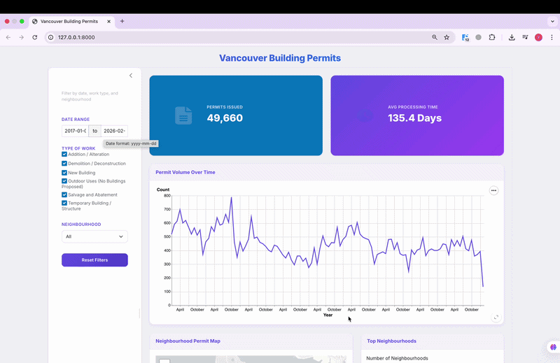

# City of Vancouver Building Permits Dashboard


[](https://019c9398-bb34-8e51-81f9-ab408b2265d5.share.connect.posit.cloud/)
[](https://019c939c-0035-bdf2-f7f3-3c47ab720907.share.connect.posit.cloud/)

An interactive dashboard built with **Python Shiny** to explore Building Permit data from the City of Vancouver (2017–present).

This dashboard enables real estate developers, agents, city planners, and stakeholders to analyze construction activity, approval timelines, and neighbourhood development trends across Vancouver through interactive visuals and dynamic filtering.

## Demo



## Motivation

Building permit data can help explain where development is happening, how long approvals take, and which neighbourhoods are seeing the most activity. In practice, the raw dataset is large and difficult to interpret quickly.

This dashboard turns that data into an interactive tool for real estate professionals, planners, and other stakeholders who need a clearer view of construction trends across Vancouver.

## Insights It Delivers

The dashboard provides:

- **Total permits issued** for the selected filters
- **Average processing time** from application to issue date
- **Permit volume over time** to highlight changes in development activity
- An **interactive neighbourhood map** showing permit distribution across Vancouver
- A summary of the **top neighbourhoods by permit volume**

## Deployments

- [Stable Build](https://019c9398-bb34-8e51-81f9-ab408b2265d5.share.connect.posit.cloud/)
- [Preview Build](https://019c939c-0035-bdf2-f7f3-3c47ab720907.share.connect.posit.cloud/)

## Installation

### 1. Clone the repository

```bash
git clone https://github.com/UBC-MDS/DSCI-532_2026_25_building_permits.git
```

```bash
cd DSCI-532_2026_25_building_permits
```

### 2. Create or update the conda environment

```bash
conda env create -f environment.yml || conda env update -f environment.yml
```

```bash
conda activate 532_group_25
```

### 3. Run the dashboard

```bash
shiny run --reload src/app.py
```

Then open the local URL shown in your terminal (usually `http://127.0.0.1:8000`).

## Project Structure

```text
DSCI-532_2026_25_building_permits/
├── data/
│   └── raw/                # Raw building permit data
├── img/                    # README and project images
├── notebooks/              # Exploratory analysis notebooks
├── reports/                # Milestone reports and project documents
├── src/
│   └── app.py              # Shiny app entry point
├── CODE_OF_CONDUCT.md
├── CONTRIBUTING.md
├── LICENSE
├── README.md
├── description.md
├── environment.yml         # Conda environment definition
├── requirements.txt        # Python package requirements
└── team.txt
```

## Contributing

Contributors are expected to follow the guidelines outlined in **[CONTRIBUTING.md](./CONTRIBUTING.md)**. Please review this document before submitting issues or pull requests.

## Contributors

Yonas Gebre Marie, Jasjot Parmar, Mehmet Imga, Oswin Gan

## Copyright

- Copyright © 2026 Yonas Gebre Marie, Jasjot Parmar, Mehmet Imga, Oswin Gan.
- Free software distributed under the [MIT License](./LICENSE).
