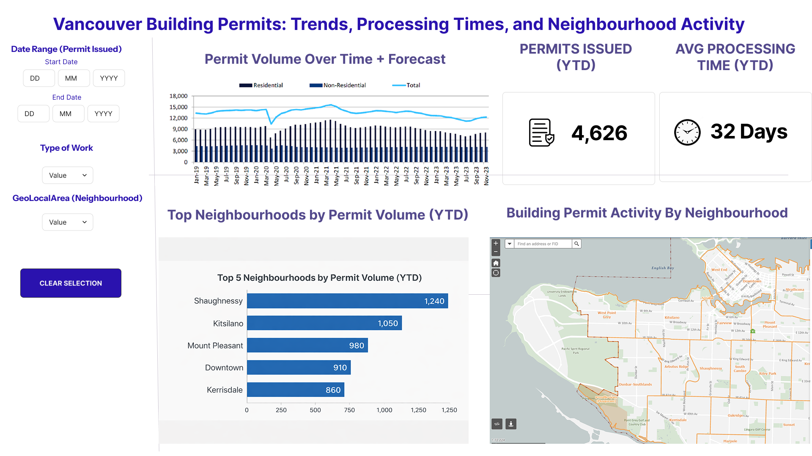

# Milestone 1 Proposal: Vancouver Building Permits Dashboard

## Section 1: Motivation and Purpose

**Our role:** Data analysts in the City of Vancouver's building department
**Target audience:** City planners at the City of Vancouver

Our target audience are city planners at the City of Vancouver. We are embodying the role of data analysts in the City of Vancouver's building department. We are a business unit within the City of Vancouver that is responsible for permitting and licensing services. The department is undergoing a transformation program where one of the core goals is to apply measurement to continuous improvement and basically make data driven decisions on what can be improved on, such as specific neighbourhoods that have a large gap between the time the permit is created and actually issued. Our ultimate goal as data analysts is to help the City of Vancouver realize process improvements to the building permit process, that could be including but not limited to: neighbourhoods that have a lack of development, the type of buildings most commonly and least applied for, and the largest (most common) building contractors.

However, city planners currently face several challenges. It is difficult to quickly asses how processing times vary across permit categories. Trends in permit volume and development activity are not easily visible at a glance. And there is limited visibility into how development activity evolves accross neighborhoods over time.

To address these challenges, we propose building an interactive data visualization dashboard that will help the City of Vancouver realize process improvements to the building permit workflow. The dashboard will provide trends in permit volume over time to measure development intensity. It will also include processing time analysis (PermitElapsedDays) by category and year to identify bottlenecks. There will be breakdowns by PermitCategory, TypeOfWork, and PropertyUse to reveal which building types are most and least commonly applied for. We also plan to have optional geographic distribution of permits across neighbourhoods to highlight areas with a lack of development, and identification of high-volume or slow-processing permit types.

## Section 2: Description of the Data

The dataset has about 49,660 records of building permits that are issued by the City of Vancouver from 2017 onward. We sourced it from the [City of Vancouver Open Data Portal](https://opendata.vancouver.ca/explore/dataset/issued-building-permits/information/). It has 20 columns covering a wide range of dimensions like financial data, processing metrics, categorical breakdowns and geographic detail.

PermitElapsedDays measures the number of calender days between permit application and issuance. This directly supports our goal of analyzing how processing times vary accross permit categories and neighbourhoods, and identifying where the bottlenecks exist.

IssueDate, PermitNumberCreatedDate, IssueYear, and YearMonth provide temporal information that lets us track permit volume trends over time. We can look at this monthly, seasonally, or year-over-year. These variables help us to address the challenge of making development activity trends visible at a glance.

ProjectValue records the estimated construction value in dollars at the time of permit issuance. This allows us to analyze average project value per neighbourhood, and it helps to identify where the largest construction investments are concentrated. We can also highlight the top neighbourhoods by value.

TypeOfWork categorizes permits into types such as New Building, Addition/Alteration, and Demolition/Deconstruction. PermitCategory provides a higher level grouping that is focused on volume and complexity. PropertyUse and SpecificUseCategory describe the general and specific use of the property, for example Dwelling Uses, Retail Store, or Laneway House. Together these variables reveal which building types are most commonly and least commonly applied for, and where processing delays are concentrated.

GeoLocalArea identifies which of Vancouver's 22 neighbourhoods the permit belongs to. Combined with Address, Geom, and geo_point_2d, these fields let us map permit distribution accross the city. This shows which neighbourhoods have active development and which ones have a lack of it.

Applicant and BuildingContractor identify the parties that are involved in each project. This supports the identification of the largest and most common building contractors that operate in the city.

We also plan to derive some additional variables to support the dashboard. For example monthly permit volume counts, average processing time broken down by permit category and neighbourhood, and average project value per neighbourhood. These derived measures directly adress the core problems of tracking development intensity, spotting processing bottlenecks, and comparing construction activity accross Vancouver's neighbourhoods.

## Section 3: Research Questions & Usage Scenarios

### Persona

Alex is a real estate developer who wants to invest in a mixed use townhouse property in Vancouver. Since real estate is so expensive in Vancouver, Alex wants to see what neighbourhoods have the most development going on right now so that he can purchase a potentially profitable property. However, no current solution exists that shows how many developments are happening or have happened in each neighbourhood. Alex wants a solution that shows up to date information on how many building permits have been issued so he can make a profitable investment.

### Usage Scenario

When Alex logs into the Building Permits Dashboard, he sees an overview of permit activity accross Vancouver. There is a time series of monthly permit volume and an interactive map that shows permit distribution by neighbourhood. He filters the view to focus on the last two years and selects "New Building" as the type of work. On the map, he notices that Kensington-Cedar Cottage and Mount Pleasant have high concentrations of new building permits, which suggest active development. He clicks on Mount Pleasant to drill down and sees that the average project value there is among the top five highest neighbourhoods, and the average permit processing time is around 150 days. He then compares this with Downtown, where project values are higher but the processing times average over 250 days. Alex also checks the permit category breakdown and sees that mixed use developments are growing steadily in Mount Pleasant. Based on these findings, Alex decides that Mount Pleasant offers a good balance of active development, reasonable approval timelines, and strong project values. This makes it a promising neighbourhood for his mixed use townhouse investment.

### User Stories

**User Story 1:**
As a real estate developer, I want to visually explore permit distribution per neighbourhood on an interactive map so that I can see which neighbourhoods are being actively developed and identify potentially profitable investment areas.

**User Story 2:**
As a real estate developer, I want to see the average time it takes for a permit to be approved by the city (issued date minus applied date) by neighbourhood and category so that I can factor approval timelines into my project planning.

**User Story 3:**
As a real estate developer, I want to view average project value per neighbourhood and see the top five highest neighbourhoods highlighted so that I can identify areas where high value construction is concentrated and asses market opportunity.

**User Story 4:**
As a city planner, I want to see a time series of permit volume per month or season, with the ability to forecast future building permits, so that I can detect seasonal patterns and plan departmental workload accordingly.

## Section 4: Exploratory Data Analysis

Exploratory Data Analysis is performed to address User Story 4, in which we visualize permit volume over time, as well as the average volume of permits by month. The first plot allows the user to view the overall trend of permit counts over the years, while the second plot aids the city planner in planning their permit requests and work according to seasonal trends.

The permits over time graph shows a sharp decline in the early 2020s, coinciding with the COVID pandemic before spiking once work was cleared to resume. Seasonally, more permit activity takes place during the summer months, or around November before tapering off during the winter and spring where work conditions are likely less than ideal.

[EDA](../notebooks/eda_analysis.ipynb)

## Section 5: App Sketch & Description

### Sketch:

**Description of Sketch:**

The dashboard is a single landing page for the City of Vancouver Planners and other external stakeholders such as developers to monitor building permit trends, processing efficiency, and neighbourhood building activity. 

The landing page shows a time series chart that shows permit volume trends over time, and also forecasts the estimated future permit volumes. This time series chart lets users look at possible seasonality and growth patterns of permits issued. 

There are key performance indicator (KPI) cards to the right of the time series chart that show the number of permits issued and average processing time of these permits for this year up until the current date. These KPI cards are meant to give a quick summary to city planners from the permits department to allow them to view overall permit issuing performance. 

The bar chart below the time series chart is meant to give planners and stakeholders a top-down summary of the neighbourhoods with the highest permits issued. This allows users to quickly analyze the neighbourhoods that are currently having the most development.  

An interactive map to the right of the bar chart acts as a selector and visualizes the permit volume for each specific Vancouver neighbourhood based on Vancouver neighbourhood boundaries. If the user clicks on a specific neighbourhood, the map re-filters the charts and KPIs to highlight only that neighbourhood. The top-neighbourhood bar chart also acts as a selector, so users can click either the map or the bar chart to drive the same neighbourhood filter. 

A left side filter panel allows the user to filter by date range, type of work (e.g. New Building, etc.), and neighbourhood. These filters let users drill down on demand so the charts and KPIs update to be based on their selected criteria.

