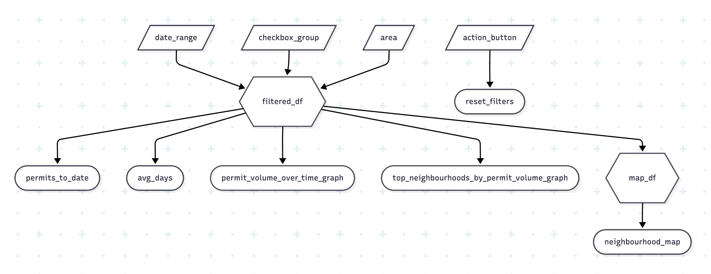

# Phase 2: App Specification

### 2.1: Updated Job Stories

| # | Job Story | Status | Notes |
|---|-----------|--------|-------|
| 1 | As a real estate developer, I want to visually see permit distribution per neighbourhood on an interactive map I can click/filter on. This will allow me to identify neighbourhoods with high development activity and potential profitable investment areas. | ✅ Implemented | `map_df` and `neighbourhood_map` implemented using `ipyleaflet` with neighbourhood polygon geometry and click-to-select behaviour. |
| 2 | As a real estate developer, I want to see the average time it takes for a permit to be approved by the city (issued date minus applied date) by neighbourhood and category so that I can see overall approval timelines when planning a development project. |  ✅ Implemented |  Calculates average processing time from the filtered_df. |
| 3 | As an end user, when I adjust the date range, permit type, or neighbourhood filters, I want all the dashboard visuals to update dynamically so I can change my view of the dashboard on the fly. | ✅ Implemented | Components update based on sidebar filters and linked output-component click interactions. |
| 4 | When analyzing development activity in Vancouver, I want to see the total number of permits issued within my preferred filters so I can quickly gauge the construction activity for specific times and areas. | ✅ Implemented | Calculates permits_to_date from filtered_df. 
| 5 | As an end user of the dashboard, I want a fast way to reset my filters so that I can reset my filters on demand and return to a full city view or show stakeholders different development behaviour on the fly based on different filters. | ✅ Implemented | reset_filters reactive effect successfully resets all filters in sidebar. |
| 6 | As a real estate agent, I want a way to see the count of permits granted per neighbourhood over time with a forecast so that I can suggest my clients to purchase in rapidly developing areas. The permit volume over time with an estimated forecast of future permit volume for my specfic filters will let me spot future trends and predict neighbourhoods that might have more growth in the future. | 🟡 In Progress | Will implement permit_volume_over_time_graph output using monthly outputs from filtered_df. |
| 7 | As a real estate agent, I want a way to see a quick summary of the top neighbourhoods that have the highest count of permits granted. This will let me see the current neighbourhoods that are being developed in the most. | ✅ Implemented | Implemented as a clickable Altair bar chart that can drive neighbourhood selection for the rest of the dashboard. |
| 8 | As a dashboard user, I want to click on a neighbourhood in either the map or the top-neighbourhood bar chart and have the whole dashboard update to that neighbourhood so that I can explore the dashboard directly from its output components. | ✅ Implemented | Advanced feature for Option D. Map polygons and top-neighbourhood bars both update the shared neighbourhood selection state and sync the dropdown input. |

### 2.1.1: Advanced Feature Choice

We implemented **Option D: Component click event interaction** from **Issue #58**.

This option fits the dashboard because neighbourhood exploration is the main workflow. Users compare neighbourhoods geographically in the map and comparatively in the top-neighbourhood bar chart, so enabling direct click-based selection from those components makes the dashboard more natural to use than relying only on sidebar controls.

### 2.2: Component Inventory 

| ID | Type | Shiny Widget / Renderer | Depends on | Job story |
|---|---|---|---|---|
| date_range | Input | `ui.input_date_range()` | — | #1, #3, #4 |
| checkbox_group | Input | `ui.input_checkbox_group()` | — | #1, #3, #4 |
| area | Input | `ui.input_selectize()` | — | #1, #3, #4, #8 |
| reset_filters | Reactive effect | `@reactive.effect` + `@reactive.event(input.action_button)` | `input.action_button` | #5 |
| selected_area | Reactive value | `reactive.Value()` | `input.area`, map click, top-neighbourhood bar click | #3, #8 |
| filtered_df | Reactive calculation | `@reactive.calc` | `input.date_range, input.checkbox_group, selected_area, permits_df` | #1, #3, #4, #8 |
| permits_to_date | Output | `ui.output_text()` + `@render.text` | `filtered_df` | #4 |
| avg_days | Output | `ui.output_text()` + `@render.text` | `filtered_df` | #2 |
| map_df | Reactive calculation | `@reactive.calc` | `filtered_df` | #1 |
| neighbourhood_map | Output | `ui.output_widget()` + `@render_widget` | `map_df`, `selected_area` | #1, #8 |
| permit_volume_over_time_graph | Output | `ui.output_widget()` + `@render_widget` | `filtered_df` | #6 |
| top_neighborhoods | Output | `ui.output_widget()` + `@render_altair` | `filtered_df`, `selected_area`, `input.top_n` | #7, #8 |
| _sync_top_neighborhood_click | Reactive effect | `@reactive.effect` + `reactive_read()` | `top_neighborhoods.widget.selections` | #8 |

### 2.3: Reactivity Diagram 

### 2.4: Calculation Details

#### Reactive Calc 1: `filtered_df`

- **Inputs**: 

    - `input.date_range`
    - `input.checkbox_group`
    - `selected_area`
    - `permits_df`

- **Transformations**: 

    Filters the original raw `permits_df` dataset so it includes:
     - permits issued within the inputted date_range
     - permits whose type matches the selected permit type in the checkbox group filter
     - permits from the selected neighbourhood/area (defaults to `"All"` if no specific neighbourhood is selected)
    
- **Outputs That Consume filtered_df**: 

    - `permits_to_date`: count of total permits based on current filters
    - `avg_days`: average number of days it takes to process or grant a permit based on current filters
    - `map_df`: prepares mapping data to create interactive map from the filtered_df
    - `top_neighborhoods`: prepares the top-neighbourhood bar chart that can also update `selected_area`

#### Reactive Calc 2: `map_df`

- **Inputs**: 

    - `filtered_df`

- **Transformations**: 

    Aggregates `filtered_df` to counts by neighbourhood so the dashboard can join permit totals onto Vancouver neighbourhood polygon geometry for mapping.
    
- **Outputs That Consume filtered_df**: 

    - `neighbourhood_map`: plots the interactive map from `map_df`.

#### Reactive Link: `selected_area`

- **Inputs**:

    - `input.area`
    - map polygon click events
    - top-neighbourhood bar click events

- **Transformations**:

    Maintains the shared neighbourhood selection state for the dashboard. This allows the sidebar dropdown, map, and top-neighbourhood chart to stay synchronized.

- **Outputs That Consume selected_area**:

    - `filtered_df`
    - `neighbourhood_map`
    - `top_neighborhoods`

